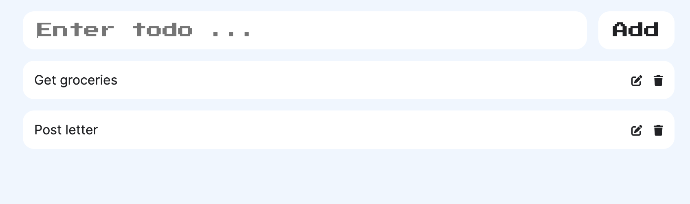

# To-Do-App

This simple to-do-list exhibits CRUD functionality allowing the user to create, read, update and delete their list with a simple and clean UI.

### Methodology

1. To initialise our list of todos by storing them inside of an array & displaying the todos.

2. Write a function that allows us to add a new todo.

3. Create a function that allows us to delete a todo.

4. Write a function that permits us to edit a todo.

5. Persist all information via local storage.

### Output

